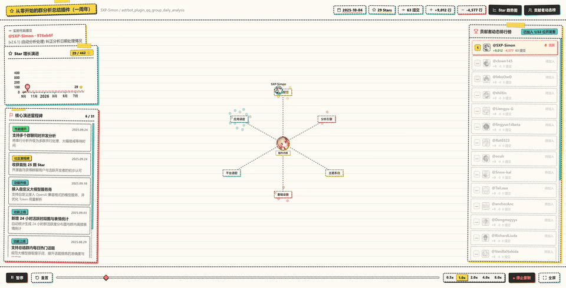
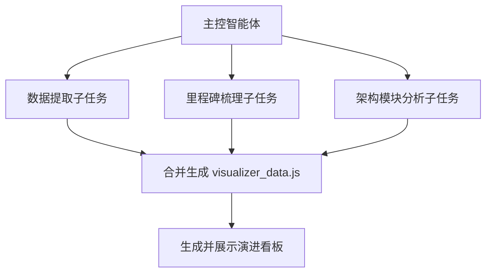

# repo-evolution-visualization-skill

> 🎨 **将 Git 提交历史、GitHub Star 趋势与贡献者轨迹，一键生成手绘涂鸦风格的交互式 Web 演化看板与 60FPS 演示视频。**
>
> 适用于 Antigravity、Claude Code、Cursor、Codex 等 AI 编码助手，也可在命令行独立运行。

---

## 🎬 效果演示

<p align="center">
  
</p>

> 💡 **提示**：上方为实况动态预览。完整 60FPS 高清演示视频与开箱即用的 Skill 压缩包，可直接在 [**GitHub Releases 发行页面**](../../releases) 下载。

---

## ✨ 核心特点

专为开源项目周年纪念、年度总结、社区致谢以及技术汇报设计的可视化工具：

```text
┌────────────────────────────────────────────────────────────┐
│                       顶部状态栏                            │
│    [ 当前演进日期 ]  [ GitHub Stars ]  [ 提交数 ]  [ 代码行 ] │
├──────────────┬──────────────────────────────┬──────────────┤
│   左侧面板   │          中央主画布          │   右侧面板   │
│              │                              │              │
│  📈 Star 曲线 │  🪐 贡献者环状动态排布        │  🏆 贡献者活跃│
│  🚀 里程碑列表│  🌻 模块文件聚类（向日葵排布）│     排行榜   │
│              │  🏷️ 仓库中心 Logo 徽章        │              │
├──────────────┴──────────────────────────────┴──────────────┤
│                       底部时间轴与工具栏                    │
│      [ 播放 / 暂停 ]  [ 进度条 ]  [ 倍速调节 ]  [ 录制视频 ] │
└────────────────────────────────────────────────────────────┘
```

1. **手绘涂鸦设计风格（Hand-Drawn Doodle）**：
   - 温暖护眼的米白纸张底色（`#fffef5`）与笔记本网格线背景；
   - 黑色手绘虚线边框与彩色记号笔阴影（珊瑚红、明黄、绿松石等）；
   - 界面整体呈现工程笔记的手绘质感，生动且富有温度。
2. **自适应的架构与动态排布**：
   - **核心辐射架构**：中央展示项目 Logo，四周连线对应模块，底层连线不遮挡中心主体；
   - **向日葵排布文件散点**：代码文件以自然的向日葵螺旋散布在对应模块周围，兼顾紧凑与呼吸感；
   - **贡献者动态轨道**：大型项目自动按活跃度分层排布，小型项目等分圆环，提交时光束连接被修改文件；
   - **大/小项目全面适配**：无论是几千次提交的成熟生态，还是几十次提交的独立小项目，均能自适应对称居中排布。
3. **支持 60FPS 高清录屏与 MP4 导出**：
   - **网页端一键录屏**：点击工具栏的「录制视频」按钮，直接录制整页高清动态视频；
   - **AI 全自动后台导出**：通过配套脚本无需打开浏览器，在终端静默生成 H.264 标准 MP4 视频。

---

## 🛠️ 环境要求

遵循 **极简与轻量化** 原则，核心数据提取与 HTML 生成 **无需安装任何第三方 pip 包**（仅依赖 Python 3.10+ 标准库）：

| 工具 | 用途 | 必需度 | 安装说明 |
| :--- | :--- | :---: | :--- |
| **`Python 3.10+`** | 数据提取与页面生成 | **必需** | 仅使用标准库，无需 `pip install` 任何包 |
| **`Git`** | 读取提交历史与作者信息 | **必需** | 系统自带或通过包管理器安装（`winget install Git.Git` / `brew install git`） |
| **现代浏览器** | 运行并查看可视化看板 | **必需** | Chrome / Edge / Firefox / Safari 均可 |
| **`GitHub CLI (gh)`** | 获取完整 Star 增长历史 | *可选* | 若未安装，支持配置 `GITHUB_TOKEN` 或自动切换为累计提交量曲线 |
| **`FFmpeg`** | 将录屏文件转换为 MP4 | *可选* | 若未安装，网页依然可直接下载 WebM 视频 |

---

## 🔑 数据获取与容错机制

各项数据均具备自动降级与容错处理，即使在离线或无权限环境下也能正常运行：

| 数据项 | 数据来源 | 默认行为 | 离线 / 权限不足时的处理 |
| :--- | :--- | :--- | :--- |
| **Git 提交记录** | 本地 `.git` 目录 | 读取 `git log` | 必需具备本地 Git 仓库历史 |
| **Star 增长历史** | GitHub API | 获取精确时间点 Star 数据 | **自动切换**为「累计提交量增长曲线」 |
| **贡献者头像** | GitHub 用户头像 API | 下载并内联 Base64 头像 | **自动生成**彩色首字母头像徽章 |
| **项目 Logo** | GitHub 仓库/组织头像 | 读取线上头像或本地 `logo.png` | **自动生成**手绘代码图标徽章 |

### 授权方式（可选）

如需拉取开源仓库的完整 GitHub Star 历史，可任选以下一种方式：

- **方式 1：GitHub CLI（推荐，无需手动复制 Token）**
  ```bash
  gh auth login
  ```
- **方式 2：配置环境变量**
  ```bash
  # Linux / macOS
  export GITHUB_TOKEN="ghp_your_token_here"
  
  # Windows PowerShell
  $env:GITHUB_TOKEN = "ghp_your_token_here"
  ```

---

## 🚀 快速开始

### 1. 安装 Skill

- **方式 A（推荐）：直接下载 Release 压缩包**  
  前往 [**GitHub Releases**](../../releases) 下载最新的 `repo-evolution-visualizer-v*.zip`，解压到你的 AI 助手 skills 目录下即可；
- **方式 B：Git 克隆**  
  将本仓库克隆到全局技能目录（如 `~/.gemini/config/skills/`）或项目的 `.agents/skills/` 目录中。

### 2. 在 AI 对话中直接使用

将任务交给你的 AI 助手（如 Antigravity / Claude Code / Cursor / Codex 等）：

```text
请使用 repo-evolution-visualizer 为当前仓库生成一套演化可视化网页，并整理出核心演进里程碑。
```

AI 助手将自动提取数据、分析架构模块、归纳中文里程碑，并生成即开即用的可视化网页。

### 3. 命令行独立运行

也可以脱离 AI 助手，在终端中直接运行脚本：

```bash
# 提取数据并自动在浏览器中打开演化看板
python skills/repo-evolution-visualizer/scripts/launch_visualizer.py \
  --repo-path "path/to/your/git/repo" \
  --github-repo "owner/repo" \
  --output-dir "./output_visualizer"

# 后台静默提取、录制并直接输出 MP4 视频
python skills/repo-evolution-visualizer/scripts/record_and_export_mp4.py \
  --repo-path "path/to/your/git/repo" \
  --github-repo "owner/repo" \
  --speed 3.0 \
  --output-mp4 "./output_evolution.mp4"
```

---

## 🤖 推荐的 AI 多智能体协同流程

在处理数千次提交的大型复杂项目时，建议主 Agent 分解为以下子任务协同执行：



1. **数据提取**：读取本地 Git 提交并获取 GitHub Star 历史；
2. **里程碑梳理**：通读 Commit 与 Release 记录，提炼 15~30 条通俗清晰的项目演进里程碑；
3. **架构模块分析**：分析目录与代码职责，配置贴合项目的模块分类规则；
4. **校验与生成**：合并数据、校验头像内联，完成可视化看板生成。

---

## 📂 目录结构

```text
repo-evolution-visualization-skill/
├── README.md                      # 项目说明文档
├── LICENSE                        # MIT 开源许可证
├── .gitignore                     # Git 忽略配置
├── .gitattributes                 # 导出与格式规范
├── .github/
│   └── workflows/
│       └── release.yml            # 自动化发版流水线
└── skills/
    └── repo-evolution-visualizer/ # Skill 核心目录
        ├── SKILL.md               # 供 AI 智能体读取的执行指南
        ├── scripts/
        │   ├── extract_repo_data.py     # Git 与 GitHub 数据提取脚本
        │   ├── launch_visualizer.py     # 一键生成与本地预览脚本
        │   ├── record_and_export_mp4.py # 自动录制与 MP4 导出脚本
        │   └── convert_to_mp4.bat       # WebM 转 MP4 工具脚本
        ├── templates/
        │   └── visualizer_template.html # 手绘涂鸦风格 HTML 模板
        └── references/
            ├── permissions_and_tokens.md     # 权限与 Token 配置说明
            ├── module_classification_guide.md # 模块映射配置指南
            └── milestone_curation_rules.md   # 里程碑文案编写建议
```

---

## 📄 开源许可证

本项目基于 [MIT License](LICENSE) 开源。
