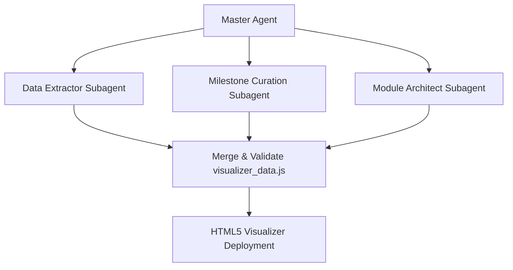

# gh-skill

面向 AI 编码智能体（Antigravity、Codex、Cursor、Claude Code 等）的专业 GitHub 与代码仓库分析技能套件。

---

## 🌟 Skills 一览

| Skill | 类别 | 说明 | 交互入口 |
| :--- | :--- | :--- | :--- |
| [`repo-evolution-visualizer`](skills/repo-evolution-visualizer/) | **代码演进与社区可视化** | 将任意 Git 仓库历史、GitHub Star 曲线、贡献者轨迹与里程碑，生成高度复用、纯手绘涂鸦风（Hand-Drawn Doodle）的交互式 Web 演化看板与 60FPS 极清展示视频 | [查看 Skill 规范](skills/repo-evolution-visualizer/SKILL.md) |

---

## 🎨 `repo-evolution-visualizer` 核心特色

这是一个专为开源项目一周年庆典、年度总结、社区答谢以及技术演进汇报打造的自动化可视化套件。

```text
       ┌────────────────────────────────────────────────────────┐
       │                   Top Status Navbar                    │
       │    [ 实时日期 ]  [ GitHub Stars ]  [ 提交数 ]  [ 代码行 ]    │
       ├──────────────┬──────────────────────────┬──────────────┤
       │  Left Dock   │    Center Canvas Stage   │  Right Dock  │
       │              │                          │              │
       │  📈 Star 曲线 │  🌌 360° 天体贡献者星环   │  🏆 贡献者竞速 │
       │  🚀 里程碑流  │  🌻 模块散点 (向日葵分布) │     排行榜    │
       │              │  🏷️ 中心 Logo 徽章       │              │
       ├──────────────┴──────────────────────────┴──────────────┤
       │             Bottom Timeline & Record Toolbar           │
       │  [ ▶ 播放/暂停 ]  [ 进度条 ]  [ 录制整页 60FPS 视频 ]    │
       └────────────────────────────────────────────────────────┘
```

### 1. 极致手绘涂鸦设计美学（Hand-Drawn Doodle）
- **实体暖白纸张底色（`#fffef5`）** 与温润的笔记本细网格；
- **高对比墨黑手绘虚线边框（`#2c2c2c`）** 与硬核标记笔微阴影（珊瑚红 `#ff6b6b`、明黄 `#ffd93d`、绿松石 `#4ecdc4`）；
- **拒绝冷冰冰的机器代号与多余 Emoji**，打造极具辨识度与温度的工程手绘感。

### 2. 严谨的架构拓扑与天体物理引擎
- **手绘核心辐射拓扑**：中央为仓库 Logo 徽章，四周环绕顶层架构模块，虚线辐射连接层严格下沉至 Logo 底层；
- **向日葵黄金角分布（Sunflower Phyllotaxis）**：代码文件以自然的向日葵点阵永久驻留，真实展现代码库的茁壮成长；
- **360° 天体环平滑自转与提交俯冲**：贡献者在外环如行星般持续旋转，提交时光束俯冲点亮文件，播放结束平滑归位。

### 3. 全页面 25Mbps 60FPS 极清录制与 1 键 MP4 导出
- **整页 UI 完整录制**：通过浏览器原生 `getDisplayMedia` 捕获完整导航栏、趋势图、里程碑流与排行榜；
- **一键开播与自动下载**：点击录制自动从 Day 1 重置并播放，停止后自动下载超清录像；
- **一键无损转码**：配备 `convert_to_mp4.bat`，1 秒调用 FFmpeg 输出 CRF 14（视觉无损）标准 H.264 MP4 视频！

---

## 🔑 数据源与权限配置指南

为了让工作流能够在不同项目与环境中高度复用，以下是各项数据源的权限说明与获取方式：

| 数据项 | 数据源 | 所需权限 / 工具 | 权限不足时的回退策略（Fallback） |
| :--- | :--- | :--- | :--- |
| **Git 提交记录** | 本地 `.git` 目录 | 本地文件读权限 (`git log`) | 必须具备本地 Git 仓库历史 |
| **Star 增长时间线** | GitHub API `/stargazers` | GitHub CLI 或 API Token | **自动平滑回退**：根据提交时间戳生成平滑拟合曲线 |
| **贡献者高清头像** | GitHub 用户头像 API | 公网网络访问 | **自动内联降级**：生成精致的彩色字母徽章 |
| **项目官方 Logo** | 本地图片文件 | 本地 `logo.png`/`logo.svg` | **自动回退**：生成标准手绘代码仓库勋章 |

### 授权方式说明

#### 方式 1：GitHub CLI 认证（最推荐，0 配置）
```bash
# 检查是否已登录
gh auth status

# 若未登录，执行网页授权
gh auth login
```

#### 方式 2：设置 `GITHUB_TOKEN` 环境变量
若在 CI/CD 或未安装 `gh` 的服务器上，生成一个包含 `public_repo` / `read:user` 权限的 Personal Access Token：
```powershell
# Windows PowerShell
$env:GITHUB_TOKEN = "ghp_your_token_here"
```
```bash
# Linux / macOS
export GITHUB_TOKEN="ghp_your_token_here"
```

> 详细权限与速率限制说明，请参阅 [**`references/permissions_and_tokens.md`**](skills/repo-evolution-visualizer/references/permissions_and_tokens.md)。

---

## 🚀 快速开始

### 1. 将 Skill 载入你的 AI 助手环境

- **Antigravity**：将本仓库克隆或复制到项目根目录的 `.agents/skills/` 或全局 `~/.gemini/config/skills/`；
- **Codex / Cursor / Claude**：复制 `skills/repo-evolution-visualizer` 到你的 skills 目录即可。

### 2. 在 AI 对话中直接调用

你只需向 AI 助手发送简单指令，例如：

```text
请使用 repo-evolution-visualizer skill 为当前仓库生成一套一周年演化可视化网页，并整理出核心里程碑事件。
```

AI 助手将自动执行数据提取、文案润色、模板编译与页面启动。

### 3. 命令行独立运行

你也可以脱离 AI 助手，直接在终端中一键提取并启动：

```bash
# 1. 提取数据并自动打开浏览器
python skills/repo-evolution-visualizer/scripts/launch_visualizer.py \
  --repo-path "C:\path\to\your\git\repo" \
  --github-repo "owner/repo" \
  --output-dir "./output_visualizer"

# 2. 录制视频后，一键转码为 MP4
.\skills\repo-evolution-visualizer\scripts\convert_to_mp4.bat
```

---

## 🤖 推荐的 Subagents 协同流水线

当处理代码历史较长、提交量达数千次的大型复杂仓库时，强烈建议让主 Agent 拆分 Subagents 协同执行：



1. **`Data Extractor Agent`**：负责运行 Git 分析与 GitHub Star API 抓取；
2. **`Milestone Curation Agent`**：通读 Commit 历史与 Tag，提炼 20~30 条通俗生动的中文里程碑；
3. **`Module Architect Agent`**：分析仓库代码结构，为 `mapFileToModule()` 配置精准的架构分类规则；
4. **`Reviewer Agent`**：校验所有头像 Base64、确保 0 跨域污染、确认 360° 天体环与视频录制功能无误。

---

## 📂 仓库目录结构

```text
gh-skill/
├── README.md                      # 仓库综合介绍与使用指南
├── LICENSE                        # MIT 开源许可证
├── .gitignore                     # Git 忽略配置
└── skills/
    └── repo-evolution-visualizer/ # 核心 Skill 包
        ├── SKILL.md               # 面向 AI 智能体的完整 Runbook 规范
        ├── scripts/
        │   ├── extract_repo_data.py   # 通用 Git & GitHub 数据提取引擎
        │   ├── launch_visualizer.py   # 一键构建与本地启动器
        │   └── convert_to_mp4.bat     # 1 键 WebM 转 H.264 MP4 脚本
        ├── templates/
        │   └── visualizer_template.html # 独立手绘涂鸦风可视化 HTML 模板
        └── references/
            ├── permissions_and_tokens.md     # GitHub 权限与 Token 配置详解
            ├── module_classification_guide.md # 多语言架构模块映射配置指南
            └── milestone_curation_rules.md   # 自然中文里程碑文案编写规范
```

---

## 📄 开源许可证

本项目采用 [MIT License](LICENSE) 许可证开源，欢迎自由使用、分发与二开定制！
