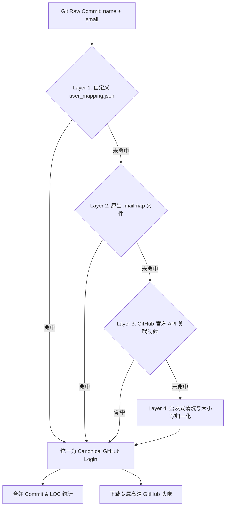

# 👥 Git 提交者身份映射与别名去重指南 (Author Mapping Guide)

在真实的 Git 仓库历史中，常常存在**同一个开发者在不同机器或不同时期使用不同用户名或邮箱提交**的情况（例如 `soulter`, `Soulter-L`, `soulter <soulter@qq.com>`, `Simon`, `SXP-Simon`）。

如果未经处理直接可视化，会导致：
1. **数据割裂**：同一位核心开发者的提交数与增删行数被分散到多个排行榜名次中；
2. **头像获取失败**：非标准 GitHub 用户名无法拉取到真实头像，退化为字母占位符。

本 Skill 提供了 **四层自动化解析与映射机制**，以实现全流程平滑统一与精确去重。

---

## 🛠️ 四层作者身份统一与映射机制



### Layer 1：自定义 `user_mapping.json`（最优先）
在运行脚本时指定 `--user-mapping path/to/mapping.json`，或在仓库根目录下放置 `user_mapping.json`。

支持两种简洁灵活的 JSON 编写格式：

#### 格式 1：分组别名列表（推荐，最直观）
```json
{
  "Soulter": [
    "soulter",
    "Soulter-L",
    "soulter@qq.com",
    "Soulter (MacBook Pro)"
  ],
  "SXP-Simon": [
    "Simon",
    "simon_dev",
    "sxp-simon@example.com"
  ]
}
```

#### 格式 2：直接别名映射键值对
```json
{
  "soulter": "Soulter",
  "Soulter-L": "Soulter",
  "soulter@qq.com": "Soulter",
  "Simon": "SXP-Simon",
  "simon_dev": "SXP-Simon"
}
```

---

### Layer 2：Git 原生 `.mailmap`
若目标仓库根目录存在 `.mailmap`，脚本会自动解析：
```text
Proper Name <proper@email.xx> Commit Name <commit@email.xx>
Soulter <soulter@qq.com> soulter-dev <dev@company.com>
```

---

### Layer 3：GitHub 官方 API 关联自动映射
当指定了 `--github-repo owner/repo` 且具备网络时：
1. 脚本会自动拉取该仓库的 GitHub 官方 Contributor 列表；
2. 自动检索近期提交的 `commit.author.email` 与真实 `author.login`、`author.avatar_url`；
3. 即使 Git 里写的是邮箱或昵称，脚本也会自动关联并映射为对应的 GitHub 正式用户名！

---

### Layer 4：启发式清洗与大小写统一
对于未显式映射的散落提交：
1. 自动过滤机器名与环境后缀（如 `(MacBook Pro)`, `(Desktop)`, `@DESKTOP-12345`）；
2. 自动进行不区分大小写的聚合（如 `soulter` 与 `Soulter` 自动归一化）；
3. 自动剥离误填入用户名框的 `<email@...>` 内容。

---

## 🖼️ 四阶头像拉取回退优先级

在为每位去重后的作者获取头像时，采用以下平滑递进策略：
1. **🥇 GitHub API 直链**：优先使用通过 GitHub API 检索到的真实 `avatar_url`；
2. **🥈 GitHub 用户名直查**：请求 `https://github.com/{canonical_name}.png?size=120`；
3. **🥉 Gravatar 邮箱哈希**：若 GitHub 头像不存在，尝试通过其 Git 提交邮箱计算 MD5 拉取 Gravatar；
4. **🏅 确定性手绘彩色字母徽章**：若上述均无结果，根据名字哈希生成美观的手绘彩色大字徽章，确保 100% 离线可用且不破坏手绘视觉体系。
