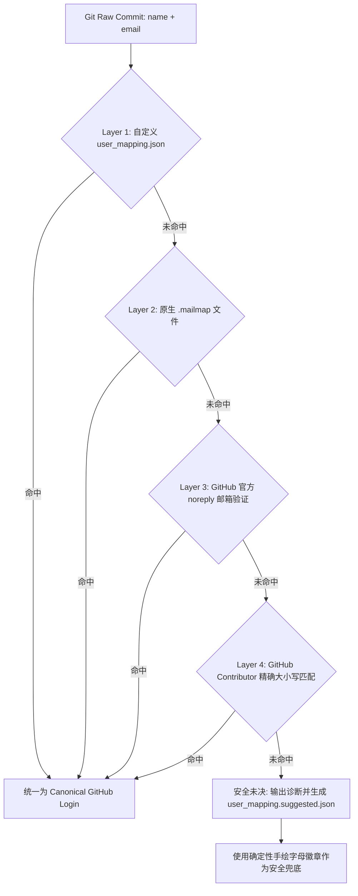

# 👥 Git 提交者身份映射与别名去重指南 (Author Mapping Guide)

在真实的 Git 仓库历史中，常常存在**同一个开发者在不同机器或不同时期使用不同用户名或邮箱提交**的情况（例如 `soulter`, `Soulter-L`, `soulter <soulter@qq.com>`, `Simon`, `SXP-Simon`）。

如果未经处理直接可视化，会导致：
1. **数据割裂**：同一位核心开发者的提交数与增删行数被分散到多个排行榜名次中；
2. **头像获取失败**：非标准 GitHub 用户名无法拉取到真实头像，退化为字母占位符。

---

## ⚠️ 为什么不能单纯依赖 GitHub API 盲目推测？

在开源项目中，常存在 **Squash and Merge、Cherry-pick、或维护者代为合并 Pull Request** 的情况：

```json
{
  "author": { "login": "maintainer_login" },
  "commit": {
    "author": { "name": "ContributorNickname", "email": "temporary@qq.com" }
  }
}
```

如果工具在后台仅凭单次 API 抽样做隐式强行绑定，极易把 **维护者的 GitHub handle 与贡献者的本地临时昵称错配（张冠李戴）**！

因此，本 Skill 严格遵循开源界最佳工程实践（如 Linux 内核与各大开源项目）：
> **“显式配置为权威事实，安全推测只做精确匹配；未决别名输出清晰诊断与建议模板，绝不盲目强行绑定。”**

---

## 🛠️ 四层作者身份统一与映射机制



### Layer 1：自定义 `user_mapping.json`（最高权威事实）
在运行脚本时指定 `--user-mapping path/to/mapping.json`，或在仓库根目录下放置 `user_mapping.json`。

支持两种简洁灵活的 JSON 编写格式：

#### 格式 1：分组别名列表（推荐，最直观）
```json
{
  "Soulter": [
    "soulter",
    "Soulter-L",
    "soulter@qq.com",
    "Soulter (MacBook Pro)"
  ],
  "SXP-Simon": [
    "Simon",
    "simon_dev",
    "sxp-simon@example.com"
  ]
}
```

#### 格式 2：直接别名映射键值对
```json
{
  "soulter": "Soulter",
  "Soulter-L": "Soulter",
  "soulter@qq.com": "Soulter",
  "Simon": "SXP-Simon",
  "simon_dev": "SXP-Simon"
}
```

---

### Layer 2：Git 原生 `.mailmap`
若目标仓库根目录存在 `.mailmap`，脚本会自动解析：
```text
Proper Name <proper@email.xx> Commit Name <commit@email.xx>
Soulter <soulter@qq.com> soulter-dev <dev@company.com>
```

---

### Layer 3：GitHub 官方 noreply 邮箱验证
自动解析官方加密 noreply 邮箱（如 `12345+username@users.noreply.github.com`），提取 100% 确定性的真实 GitHub username。

---

### Layer 4：官方 Contributor 不区分大小写精确归一
若本地 Git 用户名为 `sxp-simon`，而 GitHub 官方贡献者列表中为 `SXP-Simon`，脚本会自动完成大小写对齐。

---

## 💡 未决别名诊断与一键模板生成

当检测到有贡献者未显式映射至 GitHub 官方账号时，脚本会：
1. **在终端输出清晰的诊断提示**：
   ```text
   [!] 💡 Contributor Identity Notice: Detected 2 author alias(es) not mapped to official GitHub handles:
       - 'xiaoxi68' (email: 3520824673@qq.com)
       - '翎' (email: 1820661379@qq.com)
       -> Generated starter template at: ./web_visualizer/user_mapping.suggested.json
   ```
2. **自动生成 `<OUTPUT_DIR>/user_mapping.suggested.json` 模板**：
   维护者只需打开该文件填入真实的 GitHub 用户名，重命名为 `user_mapping.json` 即可一键生效！

---

## 🖼️ 四阶头像拉取回退优先级

在为每位去重后的作者获取头像时，采用以下平滑递进策略：
1. **🥇 GitHub API 直链**：优先使用通过 GitHub API 检索到的真实 `avatar_url`；
2. **🥈 GitHub 用户名直查**：请求 `https://github.com/{canonical_name}.png?size=120`；
3. **🥉 Gravatar 邮箱哈希**：若 GitHub 用户名不存在，尝试通过其 Git 提交邮箱计算 MD5 拉取 Gravatar；
4. **🏅 确定性手绘彩色字母徽章**：若上述均无结果，根据名字哈希生成美观的手绘彩色大字徽章，确保 100% 离线可用且不破坏手绘视觉体系。
